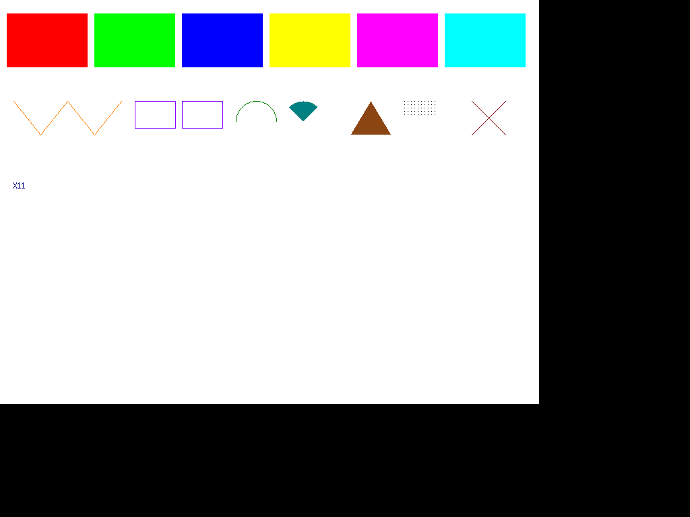
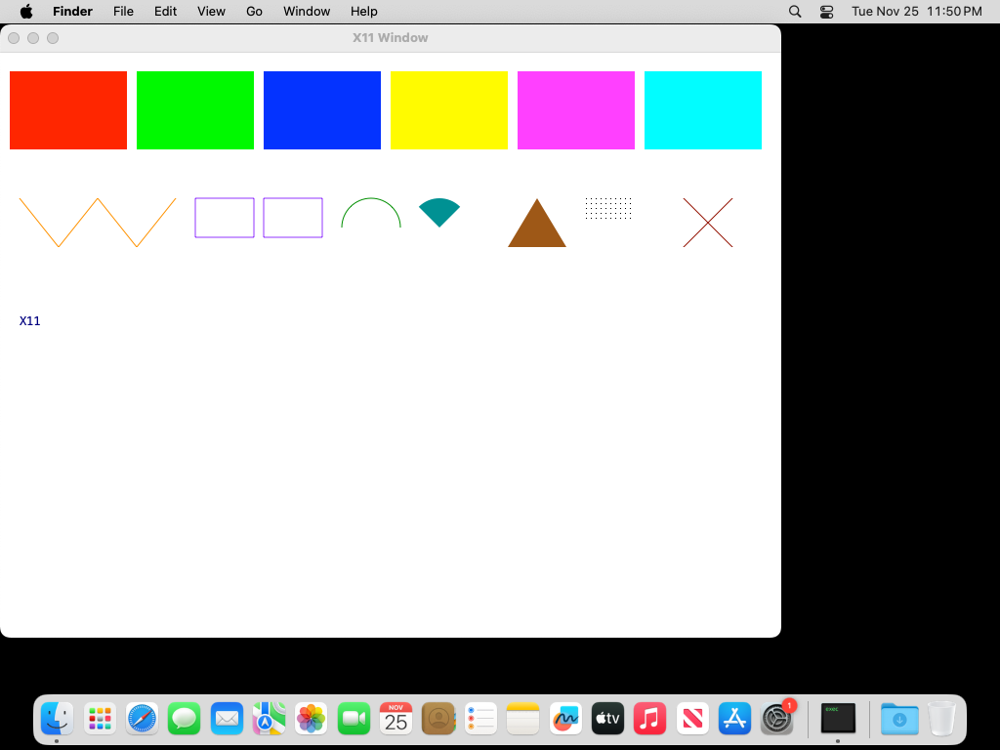
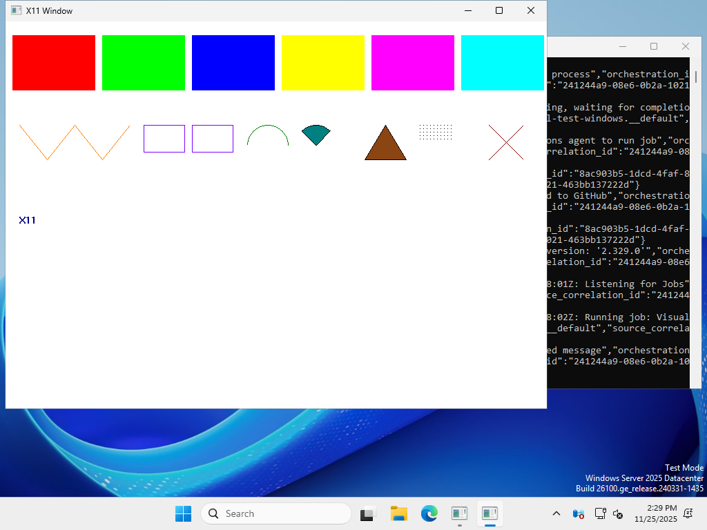

# X11Anywhere

A portable X11 server implementation in Rust with modular backend support.

## Overview

X11Anywhere is an X11 display server that can run on Linux, macOS, and Windows. It accepts X11 protocol connections from clients and translates them to native display systems through a pluggable backend architecture.

## Key Features

- **Portable**: Runs on Linux, macOS, and Windows
- **Modular Backends**: Choose your display system (X11, Wayland, macOS native, Windows native)
- **Security-Focused**: Built-in isolation and security features to protect the host
- **Minimal Dependencies**: Lightweight with minimal external dependencies
- **Protocol Compliant**: Implements the X11 core protocol

## Screenshots

Visual test output showing X11 drawing operations on all supported platforms:

| Linux | macOS | Windows |
|:-----:|:-----:|:-------:|
|  |  |  |

*Screenshots are automatically updated by CI after each push to master.*

## Architecture

```
X11 Clients (TCP/Unix Socket)
    ↓
Connection Layer
    ↓
Protocol Parser/Encoder
    ↓
Core Server (Window Tree, Resources, Events)
    ↓
Security/Isolation Layer
    ↓
Backend Abstraction
    ↓
┌──────┬─────────┬────────┬─────────┐
X11    Wayland   macOS    Windows
```

See [ARCHITECTURE.md](ARCHITECTURE.md) for detailed design documentation.

## Building

### Quick Start

By default, the appropriate backends for your platform are automatically enabled:

```bash
# Build with platform defaults (recommended)
cargo build

# On Linux/BSD: builds with X11 + Wayland backends
# On macOS: builds with macOS native backend
# On Windows: builds with Windows native backend
```

### Platform Defaults

The build system automatically enables the right backends:

- **Linux/BSD**: X11 + Wayland backends (both useful on modern Linux)
- **macOS**: macOS native backend (Cocoa/Quartz)
- **Windows**: Windows native backend (Win32)

### Custom Builds

Build with specific backends only:

```bash
# X11 only (minimal Unix build)
cargo build --no-default-features --features backend-x11

# Wayland only
cargo build --no-default-features --features backend-wayland

# Minimal builds with convenience features
cargo build --no-default-features --features minimal-x11
cargo build --no-default-features --features minimal-wayland
```

### Cross-Platform Development

You can explicitly enable backends for testing:

```bash
# Enable X11 on macOS (requires XQuartz installed)
cargo build --features backend-x11

# Test multiple backends during development
cargo build --features backend-x11,backend-wayland
```

## Usage

### Basic Usage

```bash
# Auto-detect backend
x11anywhere -display 1

# Specify backend explicitly
x11anywhere -display 1 -backend x11

# Enable TCP listening
x11anywhere -display 1 -backend wayland -tcp
```

### Security Levels

```bash
# Permissive (for testing)
x11anywhere -display 1 -security permissive

# Default (recommended)
x11anywhere -display 1 -security default

# Strict (maximum security)
x11anywhere -display 1 -security strict
```

### Command Line Options

- `-display <n>` - Display number (default: 1)
- `-backend <type>` - Backend type (x11, wayland, macos, windows)
- `-tcp` - Listen on TCP socket (port 6000 + display)
- `-unix` - Listen on Unix socket (default on Unix)
- `-security <level>` - Security level (permissive, default, strict)
- `-list-backends` - List available backends
- `-h, --help` - Show help

## Security Features

X11Anywhere includes several security features:

- **Window Isolation**: Clients can only see their own windows by default
- **Property Protection**: Restrict property access between clients
- **Selection Control**: Mediate clipboard/selection access
- **Grab Restrictions**: Limit keyboard/pointer grabs
- **Resource Limits**: Prevent resource exhaustion

Configure these with the `-security` flag or via config file.

## Use Cases

### 1. Running X11 Apps on macOS/Windows

Run Linux X11 applications natively on macOS or Windows without a full X11 server like XQuartz:

```bash
# On macOS
x11anywhere -display 1 -backend macos

# On Windows
x11anywhere -display 1 -backend windows

# Then set DISPLAY and run your app
export DISPLAY=:1
xterm
```

### 2. Nested X Server (Testing/Development)

Run a nested X server on Linux for testing:

```bash
x11anywhere -display 2 -backend x11
DISPLAY=:2 xclock
```

### 3. Wayland Bridge

Run X11 apps on Wayland with better integration:

```bash
x11anywhere -display 1 -backend wayland
```

### 4. Security Sandboxing

Run untrusted X11 applications in isolation:

```bash
x11anywhere -display 99 -security strict
DISPLAY=:99 untrusted-app
```

## Development Status

This project is in early development. Current status:

- ✅ Architecture designed and documented
- ✅ Core protocol types implemented
- ✅ Backend trait defined
- ✅ Project structure established
- ⏳ Protocol parser/encoder (in progress)
- ⏳ Core server implementation (in progress)
- ⏳ Backend implementations (not started)
- ⏳ Connection handling (basic structure done)

### Roadmap

**Phase 1: Core Protocol** (Current)
- [ ] Connection setup and authentication
- [ ] Basic window operations (Create, Map, Destroy)
- [ ] Basic drawing (rectangles, lines, text)
- [ ] Event handling
- [ ] One working backend (X11)

**Phase 2: Essential Features**
- [ ] Graphics contexts
- [ ] Pixmaps
- [ ] Properties and atoms
- [ ] Selections (clipboard)
- [ ] Fonts
- [ ] Images

**Phase 3: Additional Backends**
- [ ] Wayland backend
- [ ] macOS backend
- [ ] Windows backend

**Phase 4: Extensions**
- [ ] RENDER (alpha blending)
- [ ] XFIXES
- [ ] DAMAGE
- [ ] COMPOSITE

## Contributing

Contributions are welcome! Areas where help is needed:

- Backend implementations (especially macOS and Windows)
- Protocol implementation and testing
- Documentation and examples
- Testing with real X11 applications

## License

Licensed under either of:

- Apache License, Version 2.0 ([LICENSE-APACHE](LICENSE-APACHE) or http://www.apache.org/licenses/LICENSE-2.0)
- MIT license ([LICENSE-MIT](LICENSE-MIT) or http://opensource.org/licenses/MIT)

at your option.

## References

- [X11 Protocol Specification](https://www.x.org/releases/X11R7.7/doc/xproto/x11protocol.html)
- [Xlib Programming Manual](https://tronche.com/gui/x/xlib/)
- [XCB Protocol](https://xcb.freedesktop.org/manual/group__XCB____API.html)

## Acknowledgments

This project is inspired by:

- XQuartz - X11 for macOS
- Xwayland - X11 compatibility for Wayland
- Xephyr - Nested X server
- TigerVNC - VNC server with X11 support
